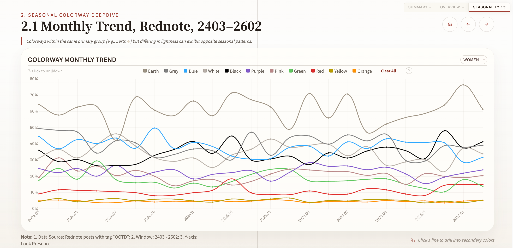

# data-analytics-slides

Cursor SKILL for creating modular, data-driven HTML slide decks for analytical reports.

## What It Does



This skill guides AI-assisted development of HTML slide decks that are:
- **Data-driven** — charts, interactive filtering, and color visualizations fed by structured data pipelines
- **Modular** — each page developed independently, merged into a single deliverable HTML via build script
- **Design-systematic** — enforced design tokens and component library for visual consistency
- **Iteratively refined** — structured revision workflow for stakeholder feedback

## When to Use

Use this skill when building an analytical report delivered as an HTML slide deck — trend studies, competitive analyses, KPI dashboards — with embedded data visualizations and interactive elements.

For generic text/image presentations (pitch decks, conference talks, tutorials), use `frontend-slides` instead.

## How This Differs from `frontend-slides`

| | `frontend-slides` | `data-analytics-slides` |
|---|---|---|
| Content type | Text + images | Data charts + interactive filtering |
| Architecture | Single file, one-shot generation | Modular dev → build → merge |
| Data layer | None | Data contracts + auto conversion scripts |
| Design system | Mood → preset picker | .impeccable.md → tokens → components |
| Charts | None | CSS bar, Chart.js line, SVG scatter, swatch gallery |
| Iteration | Generate once, enhance | Multi-round stakeholder review + structured revision |
| Viewport | Same | Same (reuses viewport-base.css) |

**TL;DR**: `frontend-slides` → pitch decks, tutorials, conference talks. `data-analytics-slides` → analytical reports with data pipelines.

## Quick Start

The skill follows 6 phases:

| Phase | Goal | Key Output |
|-------|------|------------|
| 0. Kickoff | Align requirements, set up infrastructure | `project-brief.md`, `.gitignore`, `README.md` |
| 1. Architecture | Establish modular dev structure | `build.py`, page templates, directory layout |
| 2. Design System | Create tokens + component library | `tokens.css`, `components.css`, skeleton validation |
| 3. Data Contract | Define data pipeline interface | Contract JSONs, `build_data.py` |
| 4. Implementation | Build pages with charts and interactions | Individual page HTML files |
| 5. Integration | Merge, audit, quality check | Single-file HTML, audit score ≥ 16/20 |
| 6. Revision | Handle stakeholder feedback | Classified revisions, final delivery |

## File Structure

```
data-analytics-slides/
├── SKILL.md                          # Main skill — 6-phase workflow
├── README.md                         # This file
├── architecture.md                   # Modular structure + build script template
├── design-system-template.md         # Token categories + component checklist
├── data-contract-template.md         # Contract format + conversion script
├── chart-patterns.md                 # CSS bar, Chart.js line, SVG, gallery patterns
├── revision-workflow.md              # Structured feedback → classified execution
├── reference/                        # Real-world reference implementation
│   ├── tokens-reference.css          # SP26 Color project design tokens
│   └── components-reference.css      # SP26 Color project shared components
└── presets/                          # Extensible preset directories
    ├── styles/                       # Visual style presets (tokens.css starters)
    │   └── README.md                 # How to add style presets
    └── paradigms/                    # Report architecture paradigms (sitemaps)
        └── README.md                 # How to add paradigm presets
```

## Reference Implementation

The `reference/` folder contains design tokens and component CSS extracted from the SP26 Colorway Trend Study — a production slide deck with 7 chapter pages, mirror bar charts, Chart.js timelines, SVG cluster diagrams, and a filterable color gallery.

Use these as starting points for new projects:
- Fork `tokens-reference.css` → customize colors and fonts
- Fork `components-reference.css` → adjust component styles

## Extending with Presets

### Style Presets (`presets/styles/`)

Add visual style starting points — color palettes, font combinations, spacing scales. Each preset provides a complete `tokens.css` that can be used as-is or customized.

See `presets/styles/README.md` for the format.

### Architecture Paradigms (`presets/paradigms/`)

Add report structure templates — sitemaps, per-page chart types, data contract templates. Each paradigm defines what pages to build and what data each page needs.

See `presets/paradigms/README.md` for the format.

## Key Design Decisions

### Why Modular Development?

A data analytics deck can easily reach 4000+ lines. At that size:
- AI context windows overflow, causing imprecise edits
- Changes to one page risk breaking others
- Parallel development is impossible

The modular approach keeps each source file under 500 lines. A simple `build.py` (~100 lines) merges them for delivery.

### Why Data Contracts?

Without contracts, updating data means manually copying numbers from CSV → Excel → JS variables. With contracts, one command (`python build_data.py`) regenerates all page data from source CSVs. Changes are visible via `git diff` on JSON files.

### Why Design Tokens?

When a stakeholder says "make all card corners rounder", you change one line in `tokens.css` instead of searching 46 `border-radius` instances across 4000 lines. Every sizing value uses `clamp()` for responsive behavior.

## Origin

This skill was designed based on the retrospective of the SP26 Colorway Trend Study project (2026-03 to 2026-04), which identified 10 key improvement areas for AI-assisted analytical slide deck development. The full retrospective is documented in the project's `docs/project-retrospective.md` and `docs/project-retrospective-QA.md`.
